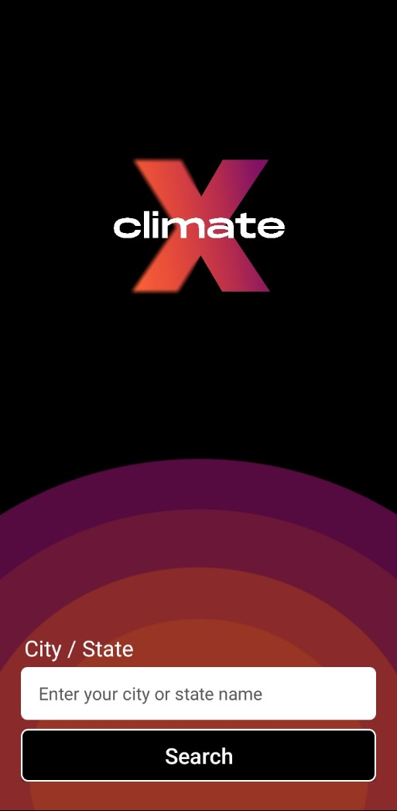

# Welcome to ClimateX 🌦️

### Your Ultimate Weather Companion

Looking for an intuitive weather forecasting app that keeps you informed about weather conditions, temperature trends, pressure, humidity, and more? Look no further than ClimateX!

### Why ClimateX?

- **Comprehensive Weather Data**: Get detailed insights into weather conditions, temperature variations, pressure changes, and humidity levels for any state or city of your choice.
  
- **User-Friendly Interface**: ClimateX offers a sleek and intuitive interface designed to provide you with the information you need at a glance, ensuring a seamless user experience.

- **Personalized Forecasting**: Tailor your weather experience by selecting your preferred locations and customizing your dashboard to display the data that matters most to you.

- **Reliable and Accurate**: Powered by cutting-edge weather data sources, ClimateX delivers reliable and accurate forecasts to help you plan your day with confidence.

### Features:

- **Current Weather**: Instantly view the current weather conditions for any location, including temperature, humidity, wind speed, and more.

- **Hourly Forecast**: Plan ahead with hourly forecasts that give you a detailed breakdown of expected weather patterns throughout the day.

- **Daily Forecast**: Stay informed about weather trends with daily forecasts that provide insights into temperature highs and lows, precipitation chances, and more.

- **Interactive Maps**: Explore weather patterns visually with interactive maps that allow you to track storms, monitor temperature gradients, and more.

### Built with Kotlin:

ClimateX is crafted with Kotlin, a powerful and modern programming language for building robust Android applications. Kotlin's concise syntax, null safety, and seamless interoperability with Java make it the perfect choice for developing feature-rich and reliable mobile apps.

### Getting Started:

1. **Clone the Repository**: Start by cloning the ClimateX repository to your local machine.
   
2. **Install Dependencies**: Navigate to the project directory and install the necessary dependencies using your preferred package manager.
   
3. **Run the App**: Launch ClimateX and start exploring weather forecasts for your favorite locations!

### Contribute:

ClimateX is an open-source project, and we welcome contributions from the community. Whether you're a seasoned developer or just getting started, there are plenty of ways to get involved:

- **Submit Bug Reports**: Encountered a glitch? Let us know by submitting a detailed bug report.
  
- **Suggest Features**: Have an idea for a new feature or enhancement? Share your thoughts with us!
  
- **Submit Pull Requests**: Ready to roll up your sleeves? Contribute code improvements or new features by submitting a pull request.

### Join the Community:

Connect with fellow weather enthusiasts and contributors by joining the ClimateX community:

- **GitHub Repository**: [Link](https://github.com/Raghu1124/ClimateX.git)
  
- **Discussion Forum**: Engage in discussions, ask questions, and share your insights on our community forum.

- **Follow Us**: Stay up-to-date with the latest ClimateX news and updates by following us on social media.

### Let's Get Started!

Experience the power of ClimateX and take control of your weather forecasts today. Whether you're planning a weekend getaway or simply want to stay informed about local conditions, ClimateX has you covered. Join us on this exciting journey as we revolutionize the way you interact with weather data.
